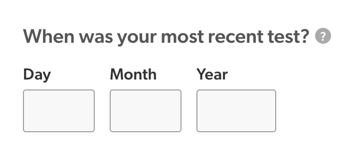
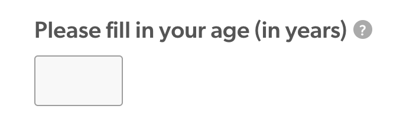
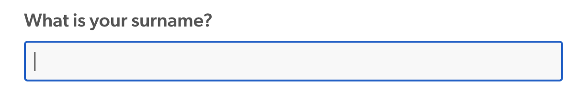
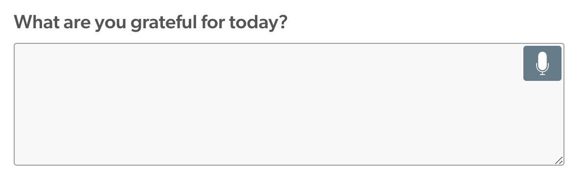
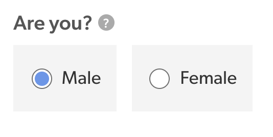
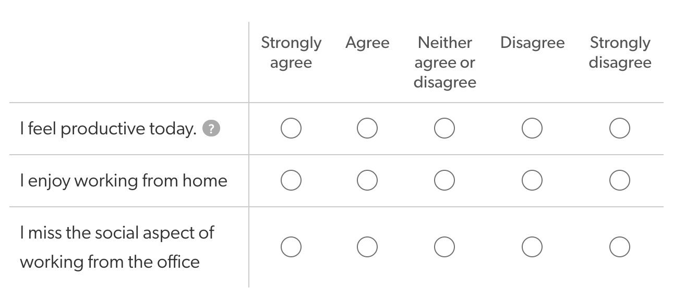
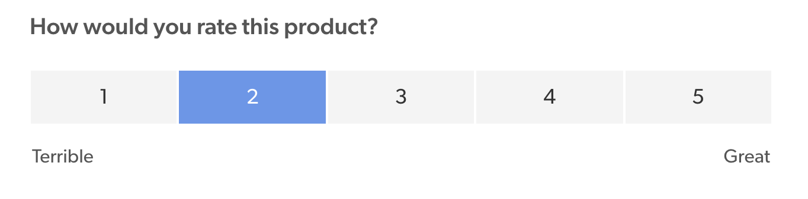
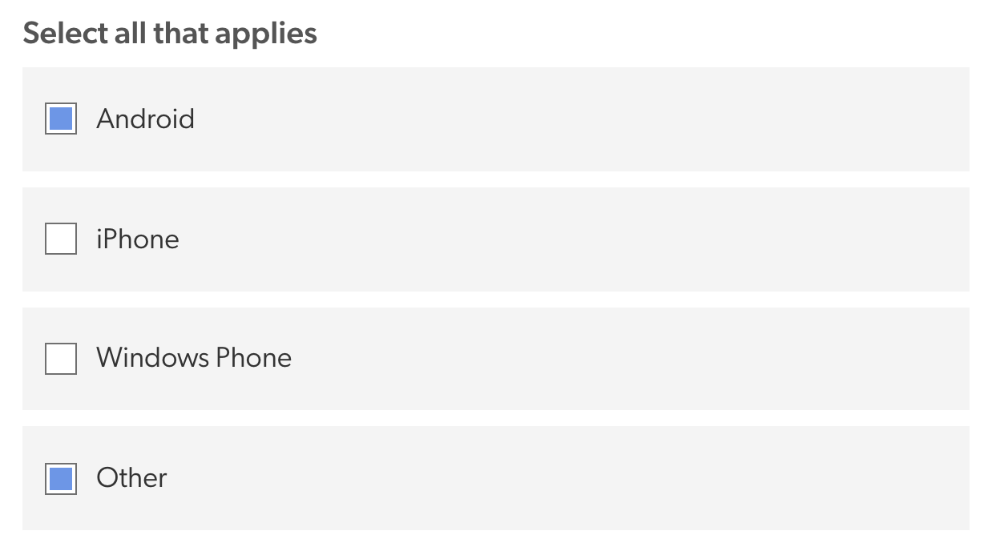
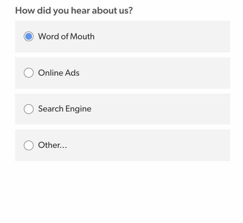

# ENDOPREM

## Project Setup
```
npm install
```

### Compiles and hot-reloads for development
```
npm run serve
```

### Compiles and minifies for production
```
npm run build
```

## Configuring Surveys

ENDOPREM renders survey questions from the schema in `src/data/index.js`, which is imported in `src/components/PreHealthForm.vue`. 

### Survey Schema
The survey schema looks like:
```js
{
  color: 'teal',
  sections: [ 
    [
      {
        title: 'Page title displayed on top of the page',
        description: 'Page description displayed below the title',
        questions: [
          ...questionObjects
        ]
      },
      ...pageObjects
    ], 
    ...pageSectionArrays
  ]
}
```

| Param  | Type                | Description  |
| ------ | ------------------- | ------------ |
| color  | <code>string</code> | Any valid CSS/HEX colour. Defines the theme colour, and affects the progress bar, buttons, and titles. |
| sections | <code>Array&lt;<a href="#pageSectionArray">pageSectionArray</a>&gt;</code> | An array of sections in the survey. Sections show as numbered progress dots on the progress bar. The first sectionArray doesn't show a progress dot as it is considered the landing page. The last section array shows as a check mark dot on the progress bar. |

#### pageSectionArray
|   | Type                | Description  |
| ------ | ------------------- | ------------ |
| pageSectionArray | <code>Array&lt;<a href="#pageObject">pageObject</a>&gt;</code> | An array of pages within a section. Each section can contain more than one page. The number of pages in a section determines the size of progress step in the section as displayed in the progress bar. |
### pageObject
`pageObject`s represent pages in a section. A page is rendered through the `src/components/Page.vue` component. Each `pageObject` can have a `title` that is displayed at the top of the page, a `description` that is a free text displayed under the title, and an array of `questions`.

| Param  | Type                | Description  |
| ------ | ------------------- | ------------ |
| title  | <code>string</code> | Page title displayed on top of the page. |
| description | <code>string</code> | Page description displayed below the title. |
| questions | <code>Array&lt;<a href="questionObject">questionObject</a>&gt;</code> | An array of questions in a page.|
### questionObject
`questionObject`s represent a question or a display element (separator, video, image) in a page. `questionObject` has two required parameters, `name` and `type`. The following table shows the shared parameters across all question types (except for the `separator`, which only requires a `type` parameter). Each question type has extra parameters that might be required.
| Param  | Type                | Description  |
| ------ | ------------------- | ------------ |
| name  | <code>string</code> | **Required**. A unique string to identify the specific question in the survey. It should be unique across all of the pages and sections. Data output will use `name` as a key to identify the question. |
| type  | <code>string</code> | **Required**. Any of the defined question types. See <a href="#question-types">Question Types</a> for the currently supported types and how to configure them.  |
| subsection  | <code>boolean</code> | **Required**. Default is `false`. Indicates that the question is a part of a <a href="#section">`section`</a> type question. While it might seem unnecessary, omitting it can cause some breaking changes *(TODO fix)*.   |
| question  | <code>string</code> | The question's main text. |
| description  | <code>string</code> | Shows a description under the question's text. |
| help  | <code>string</code> | Shows a hint when hovering over the question mark dot next to the question text. |
| validationRules | <code>object</code> | Validation rules for the question. The page cannot progress if the set validation rules for a question are not met. Each `type` has different possible rules, but the `required` rule is valid across all question types. It is set to `false` by default.


### Question Types

The project has some pre-defined question types and display elements. There are:
- <a href="#date">`date`</a>
- <a href="#number">`number`</a>
- <a href="#text">`text`</a>
- <a href="#long-text">`long-text`</a>
- <a href="#radio">`radio`</a>
- <a href="#likert-table">`likert-table`</a>
- <a href="#likert-bar">`likert-bar`</a>
- <a href="#checkbox">`checkbox`</a> (not finished)
- <a href="#image">`image`</a>
- <a href="#video">`video`</a>
- <a href="#separator">`separator`</a>
- <a href="#section">`section`</a>

#### date
A question of type `date` will show a Day, Month and Year field. It doesn't need any extra parameters aside from the default ones mentioned in <a href="#questionObject">questionObject</a>.




`validationRules` for `date` questions can have the following options:

| Option  | Type                | Description  |
| ------ | ------------------- | ------------ |
| required | <code>boolean</code> | Default `false`. When set to `true` makes the question required and does not allow the page progress without answering the question |
| min | <code>number</code> | The minimum age or the number of years a date can be in the future. Assuming we're in the year 2022, a `min` value of `20` means the dates cannot go above year 2042. | 
| max | <code>number</code> | The maximum age or the number of years a date can be in the past. Assuming we're in the year 2022, a `max` value of `20` means the dates cannot go below year 2002. | 

Example `date` question:
```js
{
  question: "When was your most recent test",
  help: "Enter your date of your last test in the Day, Month and Year fields",
  name: "last_test",
  type: "date",
  validationRules: {
    min: 0,
    max: 120,
    required: true
  }
}
```

#### number
A question of type `number` will show a field that accepts numerical input values. It doesn't need any extra parameters aside from the default ones mentioned in <a href="#questionObject">questionObject</a>.



`validationRules` for `number` questions can have the following options:


| Option  | Type                | Description  |
| ------ | ------------------- | ------------ |
| required | <code>boolean</code> | Default `false`. When set to `true` makes the question required and does not allow the page progress without answering the question |
| min | <code>number</code> | The minimum value the field can accept. | 
| max | <code>number</code> | The maximum value the field can accept. | 

Example `number` question:
```js
{    
  question: "Please fill in your age (in years)",
  name: "age",
  type: "number",
  validationRules: {
    min: 18,
  }
}
```

#### text
A question of type `text` will show an input text field. It doesn't need any extra parameters aside from the default ones mentioned in <a href="#questionObject">questionObject</a>.



`validationRules` for `text` questions can have the following options:


| Option  | Type                | Description  |
| ------ | ------------------- | ------------ |
| required | <code>boolean</code> | Default `false`. When set to `true` makes the question required and does not allow the page progress without answering the question |
| min | <code>number</code> | The minimum length of text this field can accept. | 
| max | <code>number</code> | The maximum length of text this field can accept. | 
| length | <code>number</code> | The exact length of text this field can accept. | 

Example `text` question:
```js
{    
  question: "What is your surname?",
  name: "surname",
  type: "text",
  validationRules: {
    max: 20,
  }
}
```

#### long-text
A question of type `long-text` will show a text area. Aside from the default parameters mentioned in <a href="#questionObject">questionObject</a>, it has the following options:
| Option  | Type                | Description  |
| ------ | ------------------- | ------------ |
| canRecordAudio | <code>boolean</code> | Default is `false`. Enables recording audio for the specific question. Recorded audio is meant to replace the text in the question so none of the `validationRules` apply if an audio is recorded. |



`validationRules` for `long-text` questions can have the following options:


| Option  | Type                | Description  |
| ------ | ------------------- | ------------ |
| required | <code>boolean</code> | Default `false`. When set to `true` makes the question required and does not allow the page progress without answering the question. |
| min | <code>number</code> | The minimum length of text this field can accept. | 
| max | <code>number</code> | The maximum length of text this field can accept. | 
| length | <code>number</code> | The exact length of text this field can accept. | 

Example `long-text` question:
```js
{    
  question: "What are you grateful for today?",
  name: "grateful",
  type: "long-text",
  canRecordAudio: true,
  validationRules: {
    min: 10
  }
}
```

#### radio
A question of type `radio` will show a group of radio buttons where you can select one option at a time only. Aside from the default parameters mentioned in <a href="#questionObject">questionObject</a>, it has the following options:
| Option  | Type                | Description  |
| ------ | ------------------- | ------------ |
| options | <code>Array&lt;optionObject&gt;</code> | **Required**. An array that contains the question's radio options. |

The `optionObject` has the following params:
| Param  | Type                | Description  |
| ------ | ------------------- | ------------ |
| text | <code>string</code> | **Required**. The text of the radio option. |
| value | <code>string</code> | The radio option's value. If not set it will default to a sanitized version of the `text` string.|
| action | <code>object</code> | An action that is triggered when this option is toggled. See <a href="actions">Actions</a> for more details about actions.|




`validationRules` for `radio` questions can have the following options:


| Option  | Type                | Description  |
| ------ | ------------------- | ------------ |
| required | <code>boolean</code> | Default `false`. When set to `true` makes the question required and does not allow the page progress without answering the question |

Example `radio` question:
```js
{    
  question: "Are you?",
  name: "gender",
  type: "radio",
  options: [{
    text: "Male",
    value: "male"
  }, {
    text: "Female"
  }]
}
```


#### likert-table
A question of type `likert-table` will show a group of `radio` type questions that all share the same possible answers. On a big screen this will be displayed as a table, and on a smaller screen it will be displayed as collapsible `radio` type questions. Aside from the default parameters mentioned in <a href="#questionObject">questionObject</a>, it has the following options:
| Option  | Type                | Description  |
| ------ | ------------------- | ------------ |
| options | <code>Array&lt;string&gt;</code> | **Required**. An array that contains the question's radio options. |
| prompts | <code>Array</code>&lt;<code>string</code> &#124; <code>object</code>&gt; | Required. An array that contains each question's text in the group. `prompts` can be a string array containing the questions' texts only, or can be an object array like `{prompt: "question text goes here", help: "hint text goes here"}` which will show a hint dot next to this question. |



`validationRules` for `likert-table` questions can have the following options:

| Option  | Type                | Description  |
| ------ | ------------------- | ------------ |
| required | <code>boolean</code> | Default `false`. When set to `true` makes all the questions within the table required and does not allow the page progress without answering the questions. |

Example `likert-table` question:
```js
{    
  name: "working_from_home",
  type: "likert-table",
  options: ["Strongly agree", "Agree",
    "Neither agree or disagree", "Disagree",
    "Strongly disagree"
  ],
  prompts: [
    {
      prompt: "I feel productive today.",
      help: "I feel like I am able to do the tasks I set to myself in time and produce good results."
    },
    "I enjoy working from home",
    "I miss the social aspect of working from the office"
  ]
}
```


#### likert-bar
A question of type `likert-bar` will show a scale or range of numbers to pick one from. The start and the end of the scales can be labelled. Aside from the default parameters mentioned in <a href="#questionObject">questionObject</a>, it has the following options:
| Option  | Type                | Description  |
| ------ | ------------------- | ------------ |
| options | <code>object</code> | **Required**. Sets the range of the scale and the labels. Accepts `from`, `to`, `startText` and `endText` as params. <br><ul><li><code>from</code>: *Number*. The start of the scale or range of numbers to display. Should be less than `to`.</li><li><code>to</code>: *Number*. The end of the scale or range of numbers to display. Should be greater than `from`.</li><li><code>startText</code>: *string*. Label to display near the start of the scale.</li><li><code>endText</code>: *string*. Label to display near the end of the scale.</li></ul> |



`validationRules` for `likert-table` questions can have the following options:

| Option  | Type                | Description  |
| ------ | ------------------- | ------------ |
| required | <code>boolean</code> | Default `false`. When set to `true` makes all the questions within the table required and does not allow the page progress without answering the questions. |

Example `likert-bar` question:
```js
{    
  question: "How would you rate this product?",
  name: "rate_product",
  type: "likert-bar",
  options: {
    from: 1,
    to: 5,
    startText: "Terrible",
    endText: "Great"
  }
}
```

#### checkbox
A question of type `checkbox` will show a group of checkboxes where you can select multiple options for a question. **The functionality of `checkbox` type questions has not been tested, especially when using actions**. Aside from the default parameters mentioned in <a href="#questionObject">questionObject</a>, it has the following options:
| Option  | Type                | Description  |
| ------ | ------------------- | ------------ |
| options | <code>Array&lt;optionObject&gt;</code> | **Required**. An array that contains the question's checkbox options. |

The `optionObject` has the following params:
| Param  | Type                | Description  |
| ------ | ------------------- | ------------ |
| text | <code>string</code> | **Required**. The text of the checkbox option. |
| value | <code>string</code> | The checkbox option's value. If not set it will default to a sanitized version of the `text` string.|
| action | <code>object</code> | An action that is triggered when this option is toggled. See <a href="actions">Actions</a> for more details about actions.|




`validationRules` for `checkbox` questions can have the following options:


| Option  | Type                | Description  |
| ------ | ------------------- | ------------ |
| required | <code>boolean</code> | Default `false`. When set to `true` makes the question required and does not allow the page progress without answering the question |

Example `checkbox` question:
```js
{    
  question: "Select all that applies",
  name: "phones",
  type: "checkbox",
  options: [{
    text: "Android",
    value: "android"
  }, {
    text: "iPhone"
  }, {
    text: "Windows Phone",
    value: "windows"
  }, {
    text: "Other"
  }]
}
```

#### image
A question of type `image` is a display element meant for display purposes. It shows an image from a given URL. It doesn't need a unique `name`. Aside from the default parameters mentioned in <a href="#questionObject">questionObject</a>, it has the following options:
| Option  | Type                | Description  |
| ------ | ------------------- | ------------ |
| src | <code>string</code> | **Required**. A URL pointing to the image location. |
| title | <code>string</code> | A title for the image to go in <code>&lt;img title="{title}"&gt;</code> |
| alt | <code>string</code> | A alt title for the image to go in <code>&lt;img alt="{alt}"&gt;</code> |

`image` doesn't have any `validationRules`.

Example `image` display element:
```js
{    
  type: 'image',
  src: 'https://picsum.photos/600/480',
  title: 'A placeholder image'
}
```

#### video
A question of type `video` is a display element meant for display purposes. It shows a YouTube Video from a given YouTube video ID. It doesn't need a unique `name`. Aside from the default parameters mentioned in <a href="#questionObject">questionObject</a>, it has the following options:
| Option  | Type                | Description  |
| ------ | ------------------- | ------------ |
| youtubeId | <code>string</code> | **Required**. A YouTube video ID. If you need to find a video ID it's usually part of the youtube URL, e.g. it's `sAcj8me7wGI` for the video https://www.youtube.com/watch?v=**sAcj8me7wGI** |

`video` doesn't have any `validationRules`.

Example `video` display element:
```js
{    
  type: 'video',
  youtubeId: 'sAcj8me7wGI',
}
```

#### separator
A question of type `separator` is a display element meant for display purposes. It shows a horizontal dashed separator line. It doesn't take any options other than `type`.

`separator` doesn't have any `validationRules`.

Example `separator` display element:
```js
{    
  type: 'separator',
}
```

#### section
A question of type `section` is unique question type meant to be used with <a href="#actions">actions</a>. It works as a container for an array of questions that can be displayed or hidden as a group when an action is triggered. It requires a `name` option as actions refer to sections using the unique `name` for the section. Aside from the default parameters mentioned in <a href="#questionObject">questionObject</a>, it has the following options:
| Option  | Type                | Description  |
| ------ | ------------------- | ------------ |
| questions |<code>Array&lt;<a href="questionObject">questionObject</a>&gt;</code> | An array of questions within the section.|


`section` doesn't have any `validationRules`. However it would show a validation error if any of its child questions has a validation error. 

**Important note:** Children questions of a `section` need to have `subsection` option set to `true`.

Example `section` display element:
```js
{    
  type: 'section',
  name: 'address-section',
  questions: [{
    subsection: true,
    question: "Your full address",
    name: "address",
    type: "long-text",
  }, {
    subsection: true,
    question: "Your postcode",
    name: "postcode",
    type: "text",
  }]
}
```

### Creating Custom Question Types
If a new question type is needed, create a component for the question (current components are in in `src/components/formElements/`). Make sure to emit the answer value when it changes using `this.$emit('input', value)`.


Import it to `src/components/FormElement.vue`. You will need to add it to the end of the `div.form-element` element. The following example shows how to an imagined `CustomQuestionType` component to `FormElement.vue`:
```xml
<CustomQuestionType
  v-if="formel.type === 'CUSTOM_QUESTION_TYPE'"
  :eldata="formel"
  :color="color"
  v-model="elementValue"
  />
```  
You only need to change the `CustomQuestionType` and `CUSTOM_QUESTION_TYPE` to your new component. Validation is done using <a href="https://www.npmjs.com/package/yup">yup</a> and the validation schema is defined in `src/components/FormElement.vue` in the `buildValidationSchema()` method. If you need to validate your custom question type, add your validation rules to the `buildValidationSchema()` method.

### Actions
Options in a `radio` or `checkbox` type question can trigger actions that would affect the flow of the survey based on the selected answers. Currently only two types of actions are supported:
- **End Survey** - When an answer option is selected that carries an End Survey action, clicking the "Next" button will skip to the end of the survey.
- **Toggle Section** - When an answer option is selected that carries an Toggle Section action, it will immediately expand/collapse the `section` type question it points to.

Actions can only be configured as part of a `radio` or `checkbox` type question. Actions use the following options:
| Option  | Type                | Description  |
| ------ | ------------------- | ------------ |
| onchecked |<code>boolean</code> | **Required.** When set to `true`, the action is triggered when the option where it is defined is selected. When set to `false`, the action is triggered when the option is NOT selected. |
| type |<code>string</code> | Only needs to be set when configuring an End Survey action, in which case it needs to be set to `"end-survey"`. |
| name |<code>string</code> | Only needs to be set when configuring a Toggle Section action, in which case it needs to be set to the `name` of the `section` question it is meant to toggle. |

The following example shows two questions that are part of the same page. The first question is a `radio` question that has an answer option configured with an action. The action toggles a `section` when the "Other..." option is selected.

```js
[
  { 
    name: "referral_method",
    type: "radio",
    question: "How did you hear about us?",
    options: [{
      text: "Word of Mouth",
      value: "word_of_mouth"
    }, {
      text: "Online Ads",
      value: "online_ads"
    }, {
      text: "Search Engine",
      value: "search_engine"
    }, {
      text: "Other...",
      value: "other",
      action: {
        onchecked: true,
        name: "other-details-section"
      }
    }]
  }, {
    name: "other-details-section",
    type: "section",
    questions: [{
      subsection: true,
      question: "Please tell us more",
      name: "referred-other",
      type: "text",
    }]
  }]
```



## TODO:
Still need to write
- how to log interactions
- what output looks like
- api endpoints
- cookies and saving